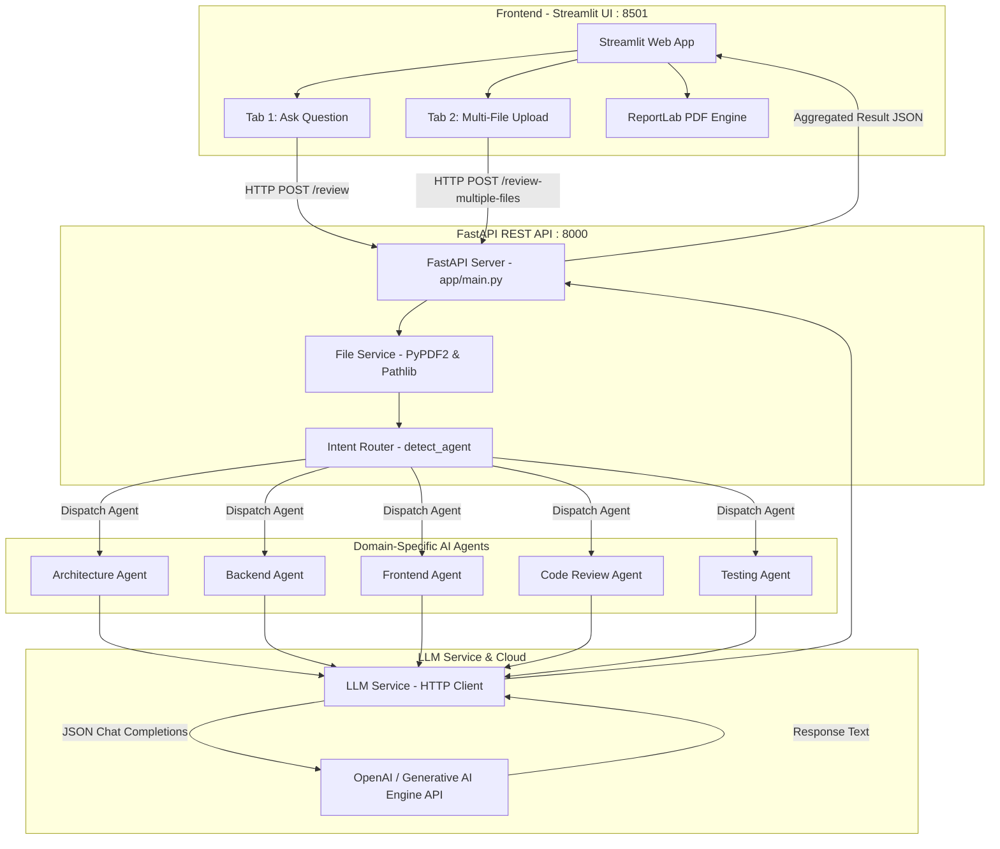

# AI SDLC Review Assistant: Master Guide & Presentation Handbook

> **Target Audience:** Engineering Students, Freshers, and Developers  
> **Project Version:** 2.0.0  
> **Domain:** Generative AI in Software Engineering / Multi-Agent SDLC Automation

---

## 1. Executive Summary & Project Overview

### What is this Project?
The **AI SDLC Review Assistant** is an intelligent, multi-agent AI system designed to automate and augment critical stages of the **Software Development Life Cycle (SDLC)**. 

Instead of treating software development as a single generic prompt to an AI, this project uses specialized **domain agents** (Architecture, Backend, Frontend, Code Review, and QA/Testing) to analyze requirements, API specifications, and codebases.

### Key Value Proposition
1. **Covers 5 Core SDLC Stages:** Architecture design, REST API specifications, Frontend & accessibility standards, code security & smells, and test case generation.
2. **Intelligent Intent Routing:** Automatically detects whether incoming text or uploaded files represent architectural documents, OpenAPI/Swagger specifications, source code, or testing requirements, dispatching them to the correct expert agent.
3. **Multi-Format Input & Multi-File Processing:** Accepts text queries or files (`.pdf`, `.java`, `.py`, `.js`, `.ts`, `.yaml`, `.json`, `.txt`) and can review entire batches with an **Executive Summary Dashboard**.
4. **Executive Reporting:** Generates downloadable reports in both machine-readable JSON format and downloadable, publication-ready PDF format.

---

## 2. High-Level System Architecture

The application is structured as a decoupled **Client-Server Micro-Agent Architecture**:



---

## 3. End-to-End Execution & Data Flow

### Flow A: Single Query Review (`/review`)
1. **User Interaction:** The user opens the Streamlit frontend, selects the **"Ask Question"** tab, types a prompt (e.g., *"Design a microservice architecture for an ecommerce application"*), and clicks **Review Query**.
2. **Frontend Request:** Streamlit sends a POST request with JSON payload `{"query": "..."}` to `http://127.0.0.1:8000/review`.
3. **Intent Detection:** FastAPI receives the request in [app/main.py](file:///c:/Users/sk725/Downloads/Project-main/Project-main/app/main.py) and passes the query string to `detect_agent(content)` in [app/router/intent_router.py](file:///c:/Users/sk725/Downloads/Project-main/Project-main/app/router/intent_router.py).
4. **Keyword Classification:**
   - The router converts the text to lowercase.
   - Finds `"microservice"` or `"architecture"` $\rightarrow$ classifies intent as `"architecture"`.
5. **Agent Dispatch:** `execute_review("architecture", query)` calls the `review(query)` function in [app/agents/architecture_agent.py](file:///c:/Users/sk725/Downloads/Project-main/Project-main/app/agents/architecture_agent.py).
6. **Prompt Assembly:** The agent reads the system persona prompt template from [app/prompts/architecture_prompt.txt](file:///c:/Users/sk725/Downloads/Project-main/Project-main/app/prompts/architecture_prompt.txt) and replaces `{query}` with the user's input.
7. **LLM Invocation:** The agent invokes [app/services/llm_service.py](file:///c:/Users/sk725/Downloads/Project-main/Project-main/app/services/llm_service.py), which reads `API_KEY`, `BASE_URL`, and `MODEL_NAME` from `.env`, formatting an HTTP POST request to `{BASE_URL}/chat/completions`.
8. **Response Formatting:** The LLM returns the generated Markdown response. The agent wraps it in a structured dictionary:
   ```json
   {
     "reviewType": "Architecture Review",
     "agent": "Architecture Agent",
     "response": "..."
   }
   ```
9. **UI Display & Export:** Streamlit receives the response, renders metric counters (Review Type, Detected Agent, Response Size), displays an agent badge, formats the markdown review inside an expandable viewer, updates `st.session_state.history`, and enables 1-click downloads as JSON or PDF.

---

### Flow B: Multi-File Batch Review (`/review-multiple-files`)
1. **File Selection:** The user uploads multiple files via Streamlit (e.g., `OrderService.java`, `sample_openapi.yaml`, `architecture.txt`).
2. **Multipart Upload:** Streamlit sends an HTTP multipart form request to `http://127.0.0.1:8000/review-multiple-files`.
3. **File Extraction:** For each file:
   - FastAPI saves the file into the `uploads/` directory.
   - [app/services/file_service.py](file:///c:/Users/sk725/Downloads/Project-main/Project-main/app/services/file_service.py) inspects the extension.
   - If PDF $\rightarrow$ uses `PyPDF2.PdfReader` to extract text page by page.
   - If Code/Text/Yaml/JSON $\rightarrow$ reads UTF-8 text safely ignoring character encoding glitches.
4. **Per-File Processing & Counting:**
   - The extracted text is run through `detect_agent()`.
   - The appropriate agent reviews the extracted content.
   - The backend increments category counters (`architectureReviews`, `backendReviews`, `frontendReviews`, `codeReviews`, `testingReviews`).
5. **Consolidated Executive Response:** FastAPI returns:
   - An `executiveSummary` containing file totals and breakdown by agent type.
   - A list of `reviews`, with each file's review result.
6. **Executive Dashboard Rendering:** Streamlit displays a 6-metric summary grid, creates individual collapsible accordions for each file review, and offers a combined JSON download.

---

## 4. Comprehensive File-by-File Breakdown

```
Project-main/
│
├── .env                       # API Credentials & configuration
├── architecture.txt           # Sample test file for Architecture Agent
├── OrderService.java          # Sample test file with security flaws for Code Review Agent
├── ProductController.java     # Sample test file for Spring Boot REST endpoint
├── sample_openapi.yaml        # Sample test file for Backend/Swagger Agent
├── test_llm.py                # Standalone test script for LLM connection
├── test_models.py             # Standalone test script for inspecting available models
│
├── app/                       # FASTAPI BACKEND ROOT
│   ├── main.py                # API routing, endpoints, execution dispatcher
│   ├── models.py              # Pydantic schemas for data validation
│   ├── agents/                # Domain-specific AI agents
│   │   ├── architecture_agent.py
│   │   ├── backend_agent.py
│   │   ├── frontend_agent.py
│   │   ├── code_review_agent.py
│   │   └── testing_agent.py
│   ├── prompts/               # Specialized persona prompt templates
│   │   ├── architecture_prompt.txt
│   │   ├── backend_prompt.txt
│   │   ├── frontend_prompt.txt
│   │   ├── code_review_prompt.txt
│   │   └── testing_prompt.txt
│   ├── router/
│   │   └── intent_router.py   # Keyword-based classification engine
│   └── services/
│       ├── file_service.py    # Multi-format text extractor (PDF & code files)
│       ├── json_parser.py     # Resilient JSON parsing with regex fallback
│       └── llm_service.py     # HTTP client for OpenAI-compatible LLM endpoint
│
└── frontend/                  # STREAMLIT FRONTEND ROOT
    ├── streamlit_app.py       # Full interactive dashboard with tabs & PDF generation
    └── components.py          # Modular UI components (summary metrics)
```

### Detailed File Analysis:

#### 1. [app/main.py](file:///c:/Users/sk725/Downloads/Project-main/Project-main/app/main.py) (The API Gateway)
- **Role:** Central entry point for the backend. Built with FastAPI.
- **Key Functions:**
  - `health()`: Simple `GET /` endpoint returning service status.
  - `execute_review(agent, content)`: Central dispatcher switch statement matching agent names (`"architecture"`, `"backend"`, `"frontend"`, `"code_review"`, `"testing"`) to their review function.
  - `review_request(request)`: `POST /review` handling JSON text queries.
  - `review_file(file)`: `POST /review-file` handling single file uploads.
  - `review_multiple_files(files)`: `POST /review-multiple-files` handling batch processing and accumulating summary metrics.

#### 2. [app/router/intent_router.py](file:///c:/Users/sk725/Downloads/Project-main/Project-main/app/router/intent_router.py) (The Brain Router)
- **Role:** Determines which specialized agent should handle the input.
- **Routing Rules:**
  - `architecture`: Triggered by `"microservice"`, `"architecture"`, `"requirement"`, `"adr"`, `"database design"`.
  - `backend`: Triggered by `"openapi"`, `"swagger"`, `"endpoint"`, `"rest api"`, `"/products"`.
  - `frontend`: Triggered by `"react"`, `"angular"`, `"wcag"`, `"component"`, `"frontend"`.
  - `code_review`: Triggered by `"public class"`, `"private"`, `"security"`, `"cyclomatic"`, `"@service"`, `"@repository"`.
  - `testing`: Triggered by `"junit"`, `"test case"`, `"@test"`, `"coverage"`.
  - **Default Fallback:** Defaults to `"architecture"`.

#### 3. [app/services/llm_service.py](file:///c:/Users/sk725/Downloads/Project-main/Project-main/app/services/llm_service.py) (The AI Bridge)
- **Role:** Encapsulates all network communication with the LLM.
- **Mechanism:**
  - Uses `python-dotenv` to securely load `API_KEY`, `BASE_URL`, and `MODEL_NAME`.
  - Sends a standard OpenAI-compatible REST request to `{BASE_URL}/chat/completions`.
  - Sets `temperature: 0.2` for deterministic, rigorous, and non-hallucinatory software reviews.
  - Sets `timeout: 120` seconds to support extensive code and document analyses.
  - Handles response unpacking: `data["choices"][0]["message"]["content"]`.

#### 4. [app/services/file_service.py](file:///c:/Users/sk725/Downloads/Project-main/Project-main/app/services/file_service.py) (File Ingestion)
- **Role:** Uniform interface to extract text from diverse file types.
- **Mechanism:**
  - Uses `pathlib.Path` to extract file extension.
  - For `.pdf`, instantiates `PdfReader(file_path)` and iterates through all pages concatenating text.
  - For code/configuration (`.java`, `.py`, `.js`, `.ts`, `.json`, `.yaml`, `.txt`), reads directly using `read_text(encoding="utf-8", errors="ignore")` to prevent unicode decode crashes.

#### 5. [app/services/json_parser.py](file:///c:/Users/sk725/Downloads/Project-main/Project-main/app/services/json_parser.py) (Resilient Parser)
- **Role:** Safely parses JSON strings produced by LLMs.
- **Mechanism:**
  - First attempts standard `json.loads(text)`.
  - If the LLM returned markdown code blocks (e.g., ````json { ... } ````), uses regular expressions `re.search(r"\{.*\}", text, re.DOTALL)` to extract the inner JSON object before parsing.
  - Fallback returns a dictionary with `"raw_response"`.

#### 6. [app/agents/](file:///c:/Users/sk725/Downloads/Project-main/Project-main/app/agents/) & [app/prompts/](file:///c:/Users/sk725/Downloads/Project-main/Project-main/app/prompts/) (Domain Agents)
- **Architecture Agent:** Evaluates system boundaries, microservices decomposition, database strategies (SQL vs NoSQL), and Architecture Decision Records (ADRs).
- **Backend Agent:** Focuses on REST API best practices, status codes, OpenAPI contracts, and endpoint versioning.
- **Frontend Agent:** Focuses on modern UI architectures, accessibility standards (WCAG 2.1 AA compliance), client-side state management, and race condition prevention.
- **Code Review Agent:** Focuses on software craftsmanship, OWASP top 10 security vulnerabilities, secret leakage, code complexity, and refactoring patterns.
- **Testing Agent:** Focuses on quality engineering, boundary test scenarios, unit tests, edge cases, and code coverage.

#### 7. [frontend/streamlit_app.py](file:///c:/Users/sk725/Downloads/Project-main/Project-main/frontend/streamlit_app.py) (The User Interface)
- **Role:** Web dashboard providing the complete user experience.
- **Features:**
  - Two intuitive tabs: Direct Prompting vs Multi-File Analysis.
  - Executive KPI summary cards and agent status badges.
  - In-browser PDF generation using `reportlab.pdfgen.canvas`.
  - Session history tracking previous queries during the browser session.

---

## 5. Beginner's Learning Guide: Concepts Explained from Scratch

As a fresher, software systems can look intimidating. Here is a clear explanation of every single foundational technology and concept used in this repository.

---

### Concept 1: What is SDLC (Software Development Life Cycle)?
In real-world software engineering, code is not written randomly. Projects follow phases:
1. **Requirements & Architecture:** Deciding what to build and how systems communicate (Microservices, Databases).
2. **Backend Development:** Building APIs, business logic, and databases.
3. **Frontend Development:** Building the user interface (React, Streamlit, HTML/CSS).
4. **Code Review:** Senior developers checking the code for security holes, performance bugs, and bad practices.
5. **Testing & QA:** Writing tests (JUnit, PyTest) to verify that everything works under normal and edge conditions.

👉 **How this project helps:** This project has an AI agent specialized in *each* of these 5 steps!

---

### Concept 2: What is an API and FastAPI?
- **API (Application Programming Interface):** A contract that allows two different programs to communicate over a network (like how Streamlit sends requests to FastAPI).
- **HTTP Methods:**
  - `GET`: Used to retrieve data (e.g., check server health).
  - `POST`: Used to send data (e.g., sending code to be reviewed).
- **FastAPI:** A modern, high-performance Python web framework for building APIs.
  - It automatically validates data using **Pydantic**.
  - It runs on top of an ASGI server named **Uvicorn**, making it very fast and asynchronous.

---

### Concept 3: What is Streamlit?
- Normally, building a web dashboard requires learning HTML, CSS, JavaScript, and React.
- **Streamlit** is a Python library that allows developers to create interactive, beautiful web interfaces using **100% pure Python**.
- Functions like `st.title()`, `st.columns()`, `st.file_uploader()`, and `st.metric()` automatically render modern web widgets.

---

### Concept 4: What is an LLM and Prompt Engineering?
- **LLM (Large Language Model):** AI models (such as GPT-4, GPT-5-mini) trained on massive amounts of text and code capable of understanding and generating code and natural language.
- **Prompt:** The text instruction provided to the AI.
- **Persona / Role Prompting:** Notice how each agent prompt starts with:
  > *"You are a Principal Enterprise Solution Architect..."*  
  > *"You are a Senior Backend Review Agent..."*
  
  By specifying the persona and strict criteria (e.g., WCAG accessibility or OWASP security), the AI is guided to think and respond like a specialist rather than giving generic answers.
- **Temperature:** A parameter (set to `0.2` in `llm_service.py`). Lower temperature (0.0 to 0.3) makes the AI output focused, logical, and deterministic, ideal for code reviews and architectural audits.

---

### Concept 5: Environment Variables (`.env`)
- **Security Rule #1 in Software Engineering:** *Never hardcode secret API keys or passwords directly into source code.*
- By placing secrets in a `.env` file and loading them with `python-dotenv` (`os.getenv("API_KEY")`), secrets stay protected from public version control.
- In fact, look at [OrderService.java](file:///c:/Users/sk725/Downloads/Project-main/Project-main/OrderService.java) in this project:
  ```java
  private String apiKey = "secret123"; // BAD PRACTICE!
  ```
  This is a deliberately flawed sample file to demonstrate how the Code Review Agent detects hardcoded credentials!

---

### Concept 6: Document & PDF Parsing
- Ordinary files like `.txt` or `.java` are simple plain text.
- But `.pdf` files are binary streams with compression and formatting commands.
- The project uses `PyPDF2.PdfReader` in [app/services/file_service.py](file:///c:/Users/sk725/Downloads/Project-main/Project-main/app/services/file_service.py) to read binary PDF pages and extract readable text strings so the AI can analyze requirement documents submitted as PDFs.

---

### Concept 7: PDF Generation with ReportLab
- In [frontend/streamlit_app.py](file:///c:/Users/sk725/Downloads/Project-main/Project-main/frontend/streamlit_app.py), the user can download a generated PDF.
- The project uses `reportlab.pdfgen.canvas.Canvas` to draw strings, lines, and page numbers onto a memory buffer (`BytesIO`) and stream it back to the user's browser without needing temporary files on disk.

---

## 6. How to Run & Test the Project Locally

### Step 1: Environment Setup
Open a terminal in `c:\Users\sk725\Downloads\Project-main\Project-main`.

If the virtual environment is already present, activate it:
```powershell
.\venv\Scripts\Activate.ps1
```
*(If execution policy restricts running scripts, run `Set-ExecutionPolicy -Scope Process -ExecutionPolicy Bypass` first).*

### Step 2: Test the LLM Connection
Run the diagnostic script:
```powershell
python test_llm.py
```
If it responds with a greeting or confirmation, your API key and endpoint are working properly!

### Step 3: Start the Backend (FastAPI)
In terminal 1:
```powershell
uvicorn app.main:app --reload --port 8000
```
- Open your browser to `http://127.0.0.1:8000/docs` to view FastAPI's interactive Swagger UI documentation!

### Step 4: Start the Frontend (Streamlit)
In terminal 2:
```powershell
streamlit run frontend/streamlit_app.py --server.port 8501
```
- Open `http://localhost:8501` to use the interactive dashboard.

---

## 7. Presentation & Demo Walkthrough Guide

When presenting this project to evaluators, interviewers, or colleagues, follow this proven structure:

### Phase 1: The Pitch (1 Minute)
> *"Good morning/afternoon. Today I am presenting the **AI SDLC Review Assistant**. In modern software engineering, development teams spend up to 40% of their time reviewing code, verifying API contracts, and writing tests. Our application acts as a specialized AI copilot across the entire Software Development Life Cycle. Rather than using a generic chatbot, it features an intelligent routing engine that routes architecture documents, OpenAPI specs, source code, and test cases to dedicated, specialized AI agents."*

### Phase 2: Live Demo Sequence (3-4 Minutes)

#### Demo 1: The Code Review Agent (Security Flaw Detection)
1. In the Streamlit UI, go to **Upload File**.
2. Select and upload [OrderService.java](file:///c:/Users/sk725/Downloads/Project-main/Project-main/OrderService.java).
3. Click **Review All Files**.
4. **Point out to audience:**
   - Notice how the router automatically detected the file as **Code Review Agent** because of keywords like `public class` and `query`.
   - Show how the AI flags:
     1. **Hardcoded Secret:** `private String apiKey = "secret123";`
     2. **SQL Injection Vulnerability:** String concatenation `WHERE ID=' + userId + '` instead of parameterized queries.
     3. **Bad Logging Practice:** Using `System.out.println` instead of an enterprise logger (SLF4J / Logback).

#### Demo 2: The Architecture Review Agent
1. Go to **Ask Question** tab.
2. Enter: *"Design an event-driven microservices architecture for an ecommerce system including product, order, payment, and inventory services."*
3. Click **Review Query**.
4. **Point out to audience:**
   - The router classified this as **Architecture Agent**.
   - Review provides: Microservice boundaries, database recommendations (Polyglot persistence: PostgreSQL for orders, MongoDB for products, Redis for caching), asynchronous messaging (Kafka/RabbitMQ), and Architectural Decision Records (ADRs).
   - Click **Download PDF Report** to show the generated PDF export.

#### Demo 3: Multi-File Batch Review & Executive Dashboard
1. Go to **Upload File** tab.
2. Upload multiple files at once: `architecture.txt`, `ProductController.java`, and `sample_openapi.yaml`.
3. Click **Review All Files**.
4. Show the **Executive Summary Dashboard** displaying total files reviewed and category breakdowns.

---

## 8. Anticipated Interview & Viva Questions (With Answers)

### Q1: Why did you use an Intent Router instead of sending everything to one prompt?
**Answer:**
> *"A single monolithic prompt suffers from prompt dilution and conflicting instructions. A prompt tuned for code security will not give optimal guidance on microservice database partitioning or WCAG frontend accessibility. By decoupling into specialized domain agents with tailored role prompts and low temperature (0.2), each agent delivers deeper, more accurate domain-specific insights."*

### Q2: How does the Intent Router work, and how would you improve it in version 3?
**Answer:**
> *"Currently, the intent router in `intent_router.py` uses deterministic keyword matching (checking for terms like `microservice`, `openapi`, `public class`, `junit`). This is fast and has zero token cost. In future iterations, we could enhance it with an LLM-based zero-shot classifier or vector semantic embeddings (cosine similarity) to classify nuanced queries where explicit keywords may be absent."*

### Q3: Why is FastAPI preferred over Flask or Django for this backend?
**Answer:**
> *"FastAPI is built on modern Python asynchronous standards (ASGI via Uvicorn), making it non-blocking and highly scalable when dealing with I/O-heavy operations like external LLM network calls. Additionally, FastAPI provides automatic request/response schema validation via Pydantic and automatically generates interactive OpenAPI/Swagger documentation at `/docs`."*

### Q4: Why is the LLM temperature set to 0.2?
**Answer:**
> *"Temperature in LLMs controls creativity versus determinism. A high temperature (0.7 to 1.0) produces varied, creative responses suitable for creative writing. In software engineering, code review, and architecture audits, we require deterministic, factual, and rigorous analysis. A low temperature like 0.2 significantly reduces hallucinations and ensures consistent evaluations."*

### Q5: How are files processed without corrupting the server?
**Answer:**
> *"Files are received as asynchronous streams via FastAPI's `UploadFile`. They are safely written to an `uploads/` directory. For text-based code files, we read with UTF-8 encoding ignoring invalid byte sequences, and for PDFs, we use `PyPDF2` to read page streams into strings before passing the sanitized text to the router."*

---

## 9. Future Enhancements (To Impress Interviewers)
If asked *"What would you add to this project next?"*, mention these:
1. **GitHub CI/CD Bot Integration:** Turn the FastAPI backend into a GitHub Webhook listener so it automatically comments on Pull Requests with code review and test suggestions.
2. **Static Analysis & SAST Tool Chaining:** Combine the LLM code review agent with static analyzers like SonarQube, Bandit (Python), or Checkstyle (Java) to combine rule-based deterministic checks with AI explanations.
3. **RAG (Retrieval-Augmented Generation):** Index company-specific coding standards and architectural principles into a Vector Database (like ChromaDB or FAISS) so the agents review code against company-specific guidelines.
