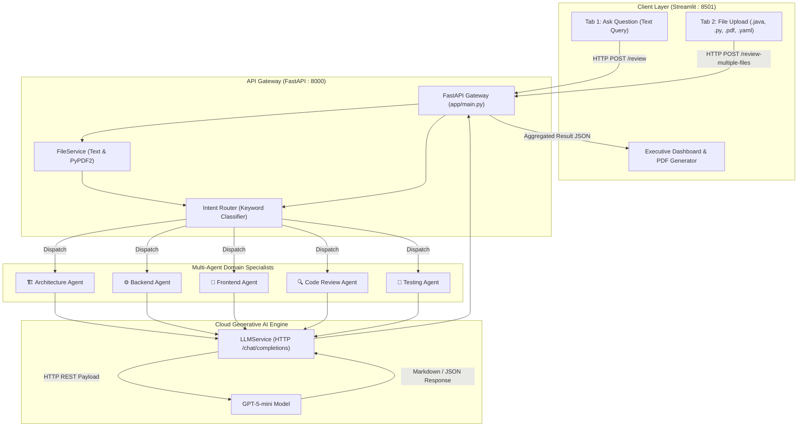

# AI SDLC Review Assistant: Complete Presentation Slide Deck & Learning Manual

---

## Slide 1: Title & Project Overview

### Slide Content
```
========================================================================
                      AI SDLC REVIEW ASSISTANT
             An Intelligent Multi-Agent System for the
                Software Development Life Cycle
========================================================================

Presented by: [Your Name]
Role: Software Engineering Trainee / Fresher
Technology Stack: Python | FastAPI | Streamlit | OpenAI GPT | ReportLab
System Architecture: Decoupled Multi-Agent Microservice
========================================================================
```

### 📘 Detailed Concept Explanation (For Freshers)
- **What is SDLC?** The **Software Development Life Cycle (SDLC)** is the standard industry process used by companies (like Google, Microsoft, TCS, Infosys) to design, develop, test, and deploy high-quality software. It consists of:
  1. Planning & Requirement Analysis
  2. Architectural & System Design
  3. Implementation & Coding (Frontend & Backend)
  4. Code Review & Security Auditing
  5. Testing & Quality Assurance (QA)
  6. Deployment & Maintenance
- **The Core Problem:** Today, software engineers spend nearly 35-40% of their working hours manually reviewing code, checking API contracts, validating architectural diagrams, and writing test scenarios.
- **The Solution:** Our project creates an **AI-powered Multi-Agent assistant** that automates reviews across 5 major SDLC stages using specialized domain agents.

### 🎙️ Speaker Notes (What to say out loud)
> *"Respected panel and members, good day. Today I am presenting my project, the **AI SDLC Review Assistant**. In modern software engineering, high code quality and robust system design are critical. However, manual reviews are slow and error-prone. Our system introduces a specialized multi-agent artificial intelligence framework that acts as a 24/7 copilot for software teams—reviewing architecture requirements, verifying REST APIs, auditing code for security risks, checking frontend accessibility, and generating comprehensive test cases."*

---

## Slide 2: Problem Statement & Motivation

### Slide Content
- **The Bottlenecks in Modern Software Delivery:**
  - 🛑 **Architectural Flaws:** Poor early design leads to catastrophic scaling failures later.
  - 🛑 **Inconsistent APIs:** Endpoints violate REST standards, lack error handling, or break OpenAPI contracts.
  - 🛑 **Security Blindspots:** Hardcoded credentials, SQL injections, and code smells pass unnoticed into production.
  - 🛑 **Accessibility Ignored:** Websites frequently fail WCAG (Web Content Accessibility Guidelines) standards.
  - 🛑 **Lack of Test Coverage:** Developers write tests as an afterthought, leaving edge cases unhandled.
- **Why Generic Chatbots Fail:**
  - Sending an entire software repository into a generic ChatGPT prompt causes **context dilution**, conflicting instructions, and hallucinations.
  - Software development requires **domain specialization**.

### 📘 Detailed Concept Explanation (For Freshers)
- **Context Dilution:** When an AI is given a huge, vague prompt (e.g. *"review my whole project"*), it tries to do everything and ends up doing nothing well.
- **Hallucination:** When an AI invents false facts, non-existent libraries, or incorrect syntax because it lacked specific constraints.
- **Why Specialization Matters:** Just like in a real software company where you have an Enterprise Architect, a Backend Lead, a Frontend Specialist, a Security Auditor, and a QA Lead, our project models this exact team structure using **5 distinct AI agents**.

### 🎙️ Speaker Notes (What to say out loud)
> *"Why did we build this? If a developer pastes an entire Java file into a standard AI chatbot, the chatbot gives a broad, generic summary. It often misses subtle SQL injections or ignores accessibility guidelines. In enterprise software, you don't ask one person to do everything. You have specialists. We applied this exact principle by creating dedicated micro-agents with tailored system prompts to address each phase of the SDLC individually."*

---

## Slide 3: High-Level System Architecture

### Slide Content


### 📘 Detailed Concept Explanation (For Freshers)
- **Client-Server Architecture:** Notice that the frontend and backend are completely separate programs:
  - The **Frontend** runs on port `8501` using **Streamlit**.
  - The **Backend** runs on port `8000` using **FastAPI**.
  - They communicate over standard HTTP network requests using JSON data.
- **Why Decouple?** If you later want to build a mobile app in Flutter or a Chrome extension, the FastAPI backend remains unchanged!

### 🎙️ Speaker Notes (What to say out loud)
> *"This diagram represents our system architecture. We implemented a decoupled client-server model. The presentation layer is powered by Streamlit, offering an intuitive dashboard. The application layer is a high-performance FastAPI server running on Uvicorn. When a request or file is submitted, it enters our File Service for ingestion, passes through our Intent Router for classification, and is delegated to the appropriate domain agent. The agent consults the generative AI engine and returns a structured evaluation back to the user."*

---

## Slide 4: Technology Stack & Why Each Tool Was Chosen

### Slide Content
| Technology | Category | Role in Project | Why Chosen? |
| :--- | :--- | :--- | :--- |
| **Python 3.14** | Core Language | Entire backend, frontend & services | Clean syntax, rich AI ecosystem, rapid development. |
| **FastAPI** | REST API Framework | Handles `/review`, `/review-file`, `/review-multiple-files` | Asynchronous speed (ASGI), automatic OpenAPI docs (`/docs`), Pydantic validation. |
| **Uvicorn** | ASGI Server | Web server running FastAPI | High-throughput asynchronous event loop handling concurrent I/O. |
| **Streamlit** | Frontend UI | Interactive web dashboard | 100% Python-based UI; eliminates complex JavaScript toolchains. |
| **Pydantic** | Data Validation | Request/response modeling (`ReviewRequest`, `ReviewResult`) | Strict schema enforcement and automatic error serialization. |
| **PyPDF2** | Document Ingestion | Extracts text from PDF documents | Handles binary PDF streams without external desktop software. |
| **ReportLab** | Document Generation | In-memory dynamic PDF generation | Compiles publication-ready PDF reports directly from memory buffers. |
| **python-dotenv** | Security & Config | Loads API keys from `.env` | Prevents credential leaks in source code repositories. |

### 📘 Detailed Concept Explanation (For Freshers)
- **ASGI vs WSGI:** Older Python frameworks (like traditional Flask or Django) used WSGI (Web Server Gateway Interface), where one request blocked a thread while waiting. FastAPI uses ASGI (Asynchronous Server Gateway Interface), which allows Python to pause and handle other tasks while waiting for network responses (like waiting for the LLM to reply).
- **Pydantic:** Think of Pydantic as a strict gatekeeper. If someone sends an integer where a string is expected, Pydantic immediately catches the error before it crashes your backend.

### 🎙️ Speaker Notes (What to say out loud)
> *"On this slide, we outline our technology stack. We chose FastAPI and Uvicorn because software reviews involve waiting for LLM network responses; FastAPI's asynchronous architecture handles these network waits without freezing the server. For the user interface, Streamlit enabled us to build a rich, responsive interface with file uploaders and metric widgets. For reporting, we integrated ReportLab to construct PDF files dynamically in RAM."*

---

## Slide 5: Deep Dive — The 5 Multi-Agent Personas

### Slide Content
```
               THE 5 SPECIALIZED SDLC AGENTS
               
 [1. Architecture Agent] ──> Microservices, Polyglot Persistence, ADRs
 [2. Backend Agent]      ──> REST Standards, OpenAPI 3.0, Status Codes
 [3. Frontend Agent]     ──> React/Angular, WCAG 2.1 AA Accessibility, State
 [4. Code Review Agent]  ──> OWASP Top 10, Hardcoded Secrets, Complexity
 [5. Testing Agent]      ──> Unit Tests, Boundary Conditions, Coverage
```

### 📘 Detailed Concept Explanation (For Freshers)
Let's understand the engineering domain of each agent:

1. **Architecture Agent ([architecture_agent.py](file:///c:/Users/sk725/Downloads/Project-main/Project-main/app/agents/architecture_agent.py)):**
   - **Microservices:** Breaking large monolithic software into small, independent services (e.g., Order Service, Payment Service).
   - **ADR (Architectural Decision Record):** A formal document explaining *why* a technology choice was made (e.g., *"Why did we choose PostgreSQL over MySQL?"*).
2. **Backend Agent ([backend_agent.py](file:///c:/Users/sk725/Downloads/Project-main/Project-main/app/agents/backend_agent.py)):**
   - **REST Conventions:** Verbs (`GET` to fetch, `POST` to create, `PUT` to update, `DELETE` to remove).
   - **OpenAPI / Swagger:** An industry-standard YAML/JSON file describing an API's routes, parameters, and responses.
3. **Frontend Agent ([frontend_agent.py](file:///c:/Users/sk725/Downloads/Project-main/Project-main/app/agents/frontend_agent.py)):**
   - **WCAG 2.1 AA (Web Content Accessibility Guidelines):** International accessibility standards ensuring websites are usable by people with visual or physical disabilities.
   - **Race Conditions:** Bugs where two asynchronous frontend requests finish in unpredictable order, causing the UI to glitch.
4. **Code Review Agent ([code_review_agent.py](file:///c:/Users/sk725/Downloads/Project-main/Project-main/app/agents/code_review_agent.py)):**
   - **Cyclomatic Complexity:** A metric measuring how many conditional branches (`if`, `for`, `while`) exist in a function. High complexity means bugs are more likely.
   - **Code Smells:** Code that works, but is poorly structured and hard to maintain.
5. **Testing Agent ([testing_agent.py](file:///c:/Users/sk725/Downloads/Project-main/Project-main/app/agents/testing_agent.py)):**
   - **Boundary Tests:** Testing the extreme limits of inputs (e.g., if age must be 18 to 65, testing 17, 18, 65, and 66).
   - **Unit Tests:** Automated scripts verifying isolated functions.

### 🎙️ Speaker Notes (What to say out loud)
> *"Let us examine the 5 agents. Each agent operates under a tailored persona with clear domain responsibilities. The Architecture Agent focuses on microservice boundaries and database choices. The Backend Agent enforces RESTful standards and inspects Swagger files. The Frontend Agent audits UI components and accessibility compliance under WCAG 2.1 AA. The Code Review Agent checks security and cyclomatic complexity. And the Testing Agent automatically synthesizes boundary conditions and unit tests."*

---

## Slide 6: The Intent Routing Engine (The Brain of the System)

### Slide Content
- **Location:** [app/router/intent_router.py](file:///c:/Users/sk725/Downloads/Project-main/Project-main/app/router/intent_router.py)
- **Function:** `detect_agent(content: str) -> str`
- **Routing Decision Tree:**
```
                      [Incoming Content / File Text]
                                    │
                       Convert to Lowercase: q
                                    │
         ┌──────────────────────────┼──────────────────────────┐
         │                          │                          │
Any match in:              Any match in:              Any match in:
["microservice",           ["openapi",                ["react",
 "architecture",           "swagger",                 "angular",
 "requirement",            "endpoint",                "wcag",
 "adr",                    "rest api",                "component",
 "database design"]        "/products"]               "frontend"]
         │                          │                          │
  ▼ Architecture Agent       ▼ Backend Agent            ▼ Frontend Agent
         │                          │                          │
         ├──────────────────────────┴──────────────────────────┤
         │                                                     │
Any match in:                                         Any match in:
["public class", "private",                           ["junit", "test case",
 "security", "cyclomatic",                             "@test", "coverage"]
 "@service", "@repository"]                                    │
         │                                              ▼ Testing Agent
  ▼ Code Review Agent                                          │
         │                                                     │
         └─────────────────── Default Fallback ────────────────┘
                                    │
                             Architecture Agent
```

### 📘 Detailed Concept Explanation (For Freshers)
- **What is Intent Routing?** When a user types a prompt or uploads a file, a computer does not automatically know what type of file it is. Intent routing is the classification mechanism that decides which specialist agent should handle it.
- **Why Keyword Routing?**
  1. **Speed:** It runs in less than 1 millisecond.
  2. **Cost-Effective:** It uses 0 LLM tokens, keeping operational costs low.
  3. **Reliable:** Keywords like `"public class"` or `"@Test"` almost exclusively indicate source code or test suites.

### 🎙️ Speaker Notes (What to say out loud)
> *"This slide explains how our system routes queries using `intent_router.py`. When text or a file is extracted, `detect_agent` analyzes the content for key domain signatures. For example, if it sees Java class annotations or security keywords, it triggers the Code Review Agent. If it spots OpenAPI or endpoint markers, it activates the Backend Agent. This rule-based router provides instant routing with zero API latency and zero token cost."*

---

## Slide 7: LLM Service & Prompt Engineering Deep Dive

### Slide Content
- **Location:** [app/services/llm_service.py](file:///c:/Users/sk725/Downloads/Project-main/Project-main/app/services/llm_service.py)
- **Core Parameters:**
  - `BASE_URL`: OpenAI-compatible Gateway endpoint
  - `MODEL_NAME`: `openai.gpt-5-mini`
  - `temperature: 0.2` (Deterministic, strict, low creativity)
  - `timeout: 120` (Supports processing large files)
- **The Prompt Engineering Pipeline:**
```
 [Template File]                   [User Query / File Content]
 app/prompts/architecture_prompt               OrderService.java
         │                                             │
         └───────────────────────┬─────────────────────┘
                                 ▼
                     String Replacement: {query}
                                 ▼
            [Fully Formatted OpenAI Chat Completion Payload]
              - Role: "user"
              - Model: "openai.gpt-5-mini"
              - Temperature: 0.2
                                 ▼
                     HTTP POST to Cloud Gateway
```

### 📘 Detailed Concept Explanation (For Freshers)
- **Why Temperature 0.2?**
  - High temperature (0.8 - 1.0) = Creative, unpredictable, varied responses (good for writing stories).
  - Low temperature (0.0 - 0.2) = Focused, analytical, repeatable responses (essential for security and code reviews where you need facts, not creativity).
- **Role / Persona Prompting:** By telling the model *"You are a Principal Enterprise Solution Architect"*, the model accesses domain terminology and patterns that a generic prompt would miss.

### 🎙️ Speaker Notes (What to say out loud)
> *"Let us look at how the LLM Service communicates with the generative AI model. We configure the LLM with a low temperature of 0.2. In code reviews and architecture design, hallucinations and creativity are risks; we need consistency and technical precision. Each agent has its own prompt template that establishes a rigorous persona, injects the user's input, and sends an OpenAI-compatible payload over HTTPS."*

---

## Slide 8: File Ingestion & Multi-Format Processing

### Slide Content
- **Location:** [app/services/file_service.py](file:///c:/Users/sk725/Downloads/Project-main/Project-main/app/services/file_service.py)
- **Supported Formats:**
  - 📄 Documents: `.pdf`, `.txt`
  - 💻 Backend Code: `.java`, `.py`
  - 🌐 Frontend Code: `.js`, `.jsx`, `.ts`, `.tsx`
  - ⚙️ Data & Config: `.json`, `.yaml`, `.yml`
- **Ingestion Strategy:**
```
                     [Uploaded File Path]
                               │
                      Check path.suffix
                               │
             ┌─────────────────┴─────────────────┐
             │                                   │
      If extension == ".pdf"               If code / text / yaml
             │                                   │
     PyPDF2.PdfReader()               pathlib.Path.read_text()
   Iterate pages & concatenate        encoding="utf-8", errors="ignore"
             │                                   │
             └─────────────────┬─────────────────┘
                               ▼
                    Extracted Clean Text
```

### 📘 Detailed Concept Explanation (For Freshers)
- **Text vs Binary Files:** Plain text files (`.java`, `.py`) can be read directly line by line. But a `.pdf` is a binary stream with font tables, compression, and coordinates.
- **Why `PyPDF2`?** It decodes the PDF structure in Python, iterates page by page, and pulls the pure text out.
- **Why `errors="ignore"`?** Different operating systems use different text encodings (Windows CP-1252 vs Linux UTF-8). Setting `errors="ignore"` ensures that an odd byte won't crash the server.

### 🎙️ Speaker Notes (What to say out loud)
> *"A key capability of our application is multi-format ingestion. In enterprise workflows, specifications come in PDFs, Swagger specs in YAML, and code in Java or Python. Our `FileService` detects the extension dynamically. If it is a PDF, `PyPDF2` extracts the text page-by-page. If it is source code or YAML, `pathlib` safely reads the text using UTF-8 decoding, guaranteeing stability against character encoding mismatches."*

---

## Slide 9: The Streamlit Frontend & Executive Reporting

### Slide Content
- **Location:** [frontend/streamlit_app.py](file:///c:/Users/sk725/Downloads/Project-main/Project-main/frontend/streamlit_app.py)
- **Two Interactive Modes:**
  1. **Tab 1: Ask Question:** Interactive single-query analysis with real-time markdown rendering.
  2. **Tab 2: Multi-File Review:** Drag-and-drop batch upload supporting simultaneous review of multiple files.
- **Executive Summary Dashboard:**
  - Displays KPI metric cards: Total Files, Architecture Count, Backend Count, Frontend Count, Code Count, Testing Count.
- **Dual Export Options:**
  - 📥 **JSON Export:** Full machine-readable payload for CI/CD integration.
  - 📄 **PDF Export:** In-memory formatted report generated using `ReportLab`.

### 📘 Detailed Concept Explanation (For Freshers)
- **How Streamlit Works:** Unlike traditional web apps where JavaScript sends Ajax requests, Streamlit reruns its Python script from top to bottom whenever a user clicks a button or types text.
- **Session State (`st.session_state`):** Because Streamlit reruns the script, normal variables would reset. `st.session_state` acts like a memory box that keeps your search history and review results across reruns.
- **Dynamic PDF Generation:** `ReportLab` writes directly to a `BytesIO` memory stream. This means the PDF is generated in computer RAM and downloaded directly by the user without consuming disk space on the server.

### 🎙️ Speaker Notes (What to say out loud)
> *"On the frontend, Streamlit delivers an interactive user experience with zero JavaScript complexity. The dashboard is divided into two tabs: one for ad-hoc queries and another for batch file uploads. When reviewing multiple files, an Executive Dashboard provides immediate metrics on how many files fall into architecture, code review, or testing. Users can download complete reports in structured JSON or as a compiled PDF report built via ReportLab."*

---

## Slide 10: Code Security Case Study — Walkthrough of `OrderService.java`

### Slide Content
- **File Analyzed:** [OrderService.java](file:///c:/Users/sk725/Downloads/Project-main/Project-main/OrderService.java)
- **Source Code Inspected:**
```java
package com.demo.order;

public class OrderService {
    private String apiKey = "secret123"; // ❌ VULNERABILITY 1

    public void createOrder(String userId) {
        String query = "SELECT * FROM USERS WHERE ID='" + userId + "'"; // ❌ VULNERABILITY 2
        System.out.println(query); // ❌ VULNERABILITY 3
        System.out.println("Order created");
    }
}
```
- **What the Code Review Agent Detects:**
  1. 🚨 **CWE-798 (Hardcoded Credentials):** Plaintext API key committed to source code.
  2. 🚨 **CWE-89 (SQL Injection):** Unsanitized string concatenation in SQL queries allows database takeover.
  3. ⚠️ **Code Smell (Improper Logging):** `System.out.println` bypasses enterprise loggers (Logback/SLF4J).

### 📘 Detailed Concept Explanation (For Freshers)
- **What is SQL Injection?** If `userId` is supplied by an attacker as `' OR '1'='1`, the SQL query becomes:
  `SELECT * FROM USERS WHERE ID='' OR '1'='1'`
  This returns *every user in the entire database*, exposing passwords and sensitive data!
- **How to Fix it:** Use PreparedStatement / parameterized queries:
  ```java
  PreparedStatement ps = conn.prepareStatement("SELECT * FROM USERS WHERE ID = ?");
  ps.setString(1, userId);
  ```
- **Why this sample is important:** This test file proves that our Code Review Agent works on real-world enterprise flaws!

### 🎙️ Speaker Notes (What to say out loud)
> *"To validate our system's code auditing capabilities, we included `OrderService.java` as a test case. When submitted to our assistant, the Code Review Agent immediately flags three critical vulnerabilities: first, a hardcoded secret which violates security compliance; second, an unsanitized SQL string concatenation that exposes the database to SQL injection attacks; and third, the use of `System.out.println` instead of a production logging framework. The agent provides the exact remediation code."*

---

## Slide 11: End-to-End Live Demo Sequence

### Slide Content
```
               LIVE DEMONSTRATION WORKFLOW
               
 [Step 1: Start Backend]  ──> uvicorn app.main:app --reload --port 8000
 [Step 2: Start Frontend] ──> streamlit run frontend/streamlit_app.py
 [Step 3: Demo Tab 1]     ──> Enter Microservice Query -> View Architecture
 [Step 4: Demo Tab 2]     ──> Upload OrderService.java -> View Code Audit
 [Step 5: Export]         ──> Click 'Download PDF Report'
```

### 📘 Step-by-Step Command Guide
1. **Activate Virtual Environment:**
   ```powershell
   .\venv\Scripts\Activate.ps1
   ```
2. **Launch Backend API:**
   ```powershell
   uvicorn app.main:app --reload --port 8000
   ```
   *(Swagger UI available at `http://127.0.0.1:8000/docs`)*
3. **Launch Frontend Dashboard:**
   ```powershell
   streamlit run frontend/streamlit_app.py --server.port 8501
   ```
   *(Web app opens at `http://localhost:8501`)*

### 🎙️ Speaker Notes (What to say out loud)
> *"Now I will demonstrate the application running live. First, we start our FastAPI server on port 8000. Second, we launch our Streamlit dashboard on port 8501. When we upload `OrderService.java`, the system extracts the text, routes it to the Code Review Agent, and displays the risk analysis. We can immediately export this into a clean PDF report with a single click."*

---

## Slide 12: Key Technical Highlights (What Makes This Project Strong)

### Slide Content
- 🌟 **Modular Multi-Agent Architecture:** Easily extendable; adding a new agent (e.g., DevOps / Kubernetes Agent) requires just one new prompt file and a router keyword rule.
- 🌟 **Resilient JSON Parsing:** [json_parser.py](file:///c:/Users/sk725/Downloads/Project-main/Project-main/app/services/json_parser.py) uses regex fallbacks (`re.search(r"\{.*\}")`) to parse model responses even if markdown fences are present.
- 🌟 **Enterprise Security Hygiene:** No hardcoded tokens; fully managed through `.env` configurations and `python-dotenv`.
- 🌟 **Zero Frontend Build Dependencies:** Eliminates Node.js, Webpack, and npm complexities by leveraging Streamlit's pure Python UI.
- 🌟 **Batch Analytics & Reporting:** Real-time executive tallying with dual JSON and PDF document generation.

### 📘 Detailed Concept Explanation (For Freshers)
- **What is Regex Fallback in JSON?** LLMs often format their JSON answers inside markdown blocks like ````json { "key": "value" } ````. A standard `json.loads()` will crash because of the backticks. Our `json_parser.py` uses regular expressions (`re.search`) to peel away the backticks and extract the pure JSON object safely.

### 🎙️ Speaker Notes (What to say out loud)
> *"What makes this project technically strong is its clean, decoupled design. It is not a monolithic script; it follows clean architecture principles. Our JSON parser includes regex fallback mechanisms to prevent parsing errors when handling LLM outputs. Configuration is isolated via environment variables, and the system is completely modular—allowing new domain agents to be added in minutes."*

---

## Slide 13: Future Scope & Roadmap

### Slide Content
- 🚀 **1. CI/CD GitHub Action Bot:** Automatically run reviews on every Git Pull Request and post suggestions directly as GitHub comments.
- 🚀 **2. Semantic Vector Routing:** Upgrade `intent_router.py` from keyword matching to vector embeddings (using cosine similarity or ChromaDB) for zero-shot natural language classification.
- 🚀 **3. Hybrid SAST Tool Chaining:** Combine AI reviews with deterministic static analysis tools like SonarQube, Bandit, and Checkstyle.
- 🚀 **4. Enterprise RAG (Retrieval-Augmented Generation):** Allow companies to upload internal coding guidelines into a vector database so the agents enforce company-specific policies.

### 📘 Detailed Concept Explanation (For Freshers)
- **CI/CD (Continuous Integration / Continuous Deployment):** Automated pipelines that build and test code whenever a developer pushes to GitHub or GitLab.
- **RAG (Retrieval-Augmented Generation):** Giving the AI access to private company documentation so its answers reflect internal enterprise standards.

### 🎙️ Speaker Notes (What to say out loud)
> *"Looking toward future enhancements, our next step is to integrate this engine into CI/CD pipelines as a GitHub Action bot that reviews pull requests automatically. We also plan to replace keyword routing with semantic vector embeddings and introduce Retrieval-Augmented Generation (RAG) so agents can review code against an organization's specific internal standards."*

---

## Slide 14: Conclusion & Q&A

### Slide Content
```
========================================================================
                               CONCLUSION
                 AI SDLC Review Assistant (Version 2.0.0)
========================================================================

  ✅ Automated 5 key phases of the Software Development Life Cycle
  ✅ Built a scalable, asynchronous FastAPI & Streamlit architecture
  ✅ Implemented domain-specialized multi-agent prompt engineering
  ✅ Delivered real-world vulnerability detection & PDF report exports

========================================================================
                          THANK YOU!
                   Open for Questions & Answers
========================================================================
```

### 📘 Common Viva / Interview Questions Ready-to-Answer
- **Q: Why didn't you use LangChain or CrewAI?**
  - *Answer:* *"We deliberately implemented a lightweight, transparent multi-agent architecture using native Python and FastAPI. This avoids the heavy dependency overhead of third-party agent frameworks, gives us full control over prompts, timeouts, and error handling, and significantly speeds up execution."*
- **Q: How does the application handle large files?**
  - *Answer:* *"FastAPI handles files as asynchronous streams (`UploadFile`), writing them to disk before reading with `Pathlib` or `PyPDF2`. In `LLMService`, the HTTP timeout is set to 120 seconds to accommodate extensive document evaluations."*

### 🎙️ Speaker Notes (What to say out loud)
> *"In conclusion, the AI SDLC Review Assistant bridges the gap between software development practices and generative AI. By orchestrating specialized agents across the SDLC, it reduces human review overhead, enforces security hygiene, and ensures architectural consistency. Thank you for your time and attention. I am now open to any questions."*
